# Flippergotchi 🐬

[](https://github.com/haroldboom/flippergotchi/actions/workflows/ci.yml)

A **Tamagotchi-style WiFi pet** for the [**Flipper One**](https://docs.flipper.net/one).
It shares Pwnagotchi's DNA — using the radio to hunt Wi-Fi — but instead of a
pwning machine you **raise a shark**: you scan for nearby APs and choose which to
capture (a deliberate, per-AP mechanic, *not* indiscriminate deauth of everything
in range), and the captures, walks, duels and AI personality feed a creature you
care for over weeks.

> 📟 **This is for the Flipper One — NOT the Flipper Zero.** The Flipper One
> (announced May 2026, **not shipping yet**) is a Rockchip RK3576 Arm-**Linux**
> handheld — Wi-Fi 6E, Bluetooth 5.2, a 6 TOPS NPU and the FlipCTL UI — a full
> Linux computer, not the Zero's microcontroller. **Because the hardware isn't
> out, this runs entirely in simulation today** (`--simulate`) on any Linux box.
> It's a genuinely complete game against a simulated device: fake WiFi/GPS/BLE
> events drive the *real* game loop, and every hardware hook is a clearly-marked,
> abstraction-gated seam that lights up when a device exists. No overclaiming —
> it's an impressive sim of an unreleased device.
>
> 🖥️ **The screen is 256×144, 6-bit (64-level) grayscale**
> ([official specs](https://docs.flipper.net/one/general/tech-specs)) — so the
> device renders below are grayscale and **dithered**, matching what the panel
> shows. Source sprites are colour and auto-desaturated for the device.

- **WiFi APs are monsters you catch.** Each access point is a creature; net its
  handshake and it joins your **dex** (a real creature-collector collection —
  "caught X of 19 species", not a packet log).
- **Walking is the fitness core.** Movement → XP → levels → evolutions
  (egg → … → legend), and your shark **forages food** (and, rarely, gear) as you
  move. Note the Flipper One has **no onboard GPS/GNSS and no IMU**, so on real
  hardware this needs an **externally attached GPS** (via `gpsd`) or another
  movement source — see [`docs/movement-mechanic.md`](docs/movement-mechanic.md).
- **Combat that actually matters.** Duels resolve from your gear (ATK/DEF/LUCK +
  set bonuses), your **element**, and a fair-fight matchmaker; the pet auto-duels
  detected peers and `duel <name>` shows you the real odds first. Cracking Wi-Fi
  stays a deterministic, tool-based act — a separate skill, not a stat check.
- **A deep, weeks-long progression loop.** Daily/weekly/monthly **quests** +
  lifetime story **chains**, tiered & hidden **achievements** with wearable
  **titles**, a real **hunger/food/larder** survival layer, **✨ shiny** catches,
  post-L40 **paragon** prestige, and a finite species-completion capstone.
- **Stakes that fit the fantasy.** In normal mode, sustained neglect makes your
  pet **sick** (XP stalls, foraging stops, happiness tanks) and it recovers when
  you feed it — care matters, but it **never dies**. Opt into **Hardcore** and
  starvation is permadeath, with a death runway and a gravestone/epitaph.
- **The pet has a voice.** The RK3576 NPU (or a CPU model, or canned phrases)
  narrates what the pet feels — and now speaks at *every* payoff: catches,
  quests, badges, cracks, shinies, and its own hunger.
- **A cyberpunk pixel-art shark** in a retro creature-collector 2D HUD at the
  native **256×144**. It **evolves** egg→legend and comes in 5 **shark species**
  (distinct silhouettes, picked with `--variant`).

> **The economy at a glance:** walk → forage *food* (+ rare gear) · encounter →
> *catch* AP-monsters · crack → *loot* + score · duel peers → gear & bragging
> rights. Foraging is a periodic reward, not a firehose; scrap has real sinks
> (up to a 5000-scrap cosmetic).

---

## What it looks like

### On the device (256×144, 6-bit grayscale, dithered)

These are the **most device-accurate renders** — each screen's HTML is rendered
in **headless WebKit** (the same engine the Flipper One runs on DRM) at exactly
256×144, then pushed through a 6-bit grayscale + **Floyd–Steinberg dithering**
step. They're the faithful *proxy* for the real panel (see
[`docs/device/README.md`](docs/device/README.md) for fidelity caveats) and are
reproducible with **`make previews`**.

| Main HUD | `prime` evolution (L20) | Encounter |
|:---:|:---:|:---:|
| 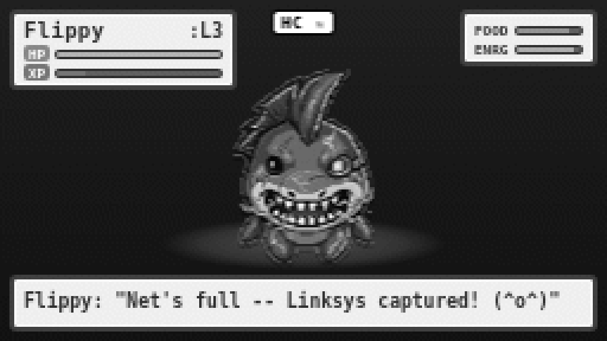 | 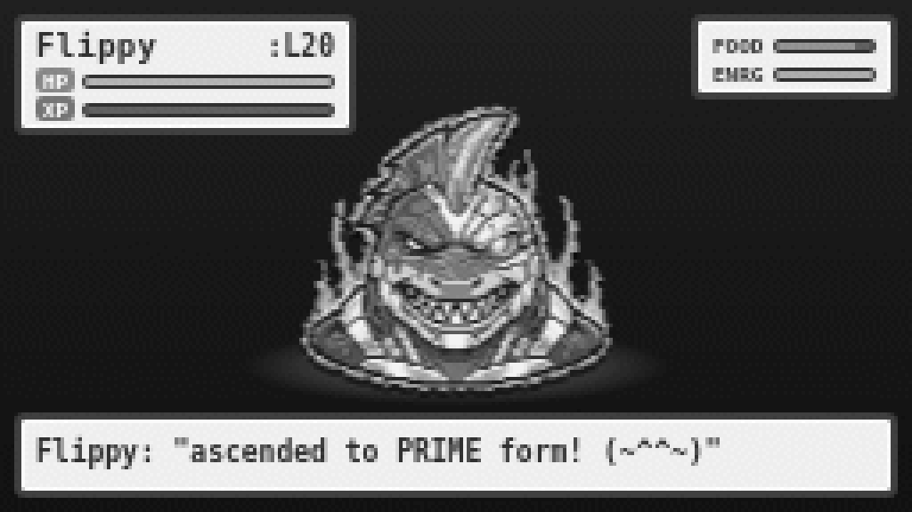 | 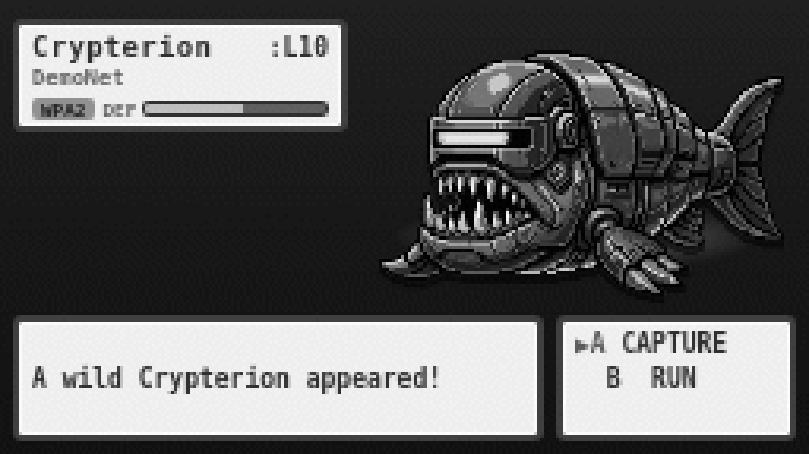 |

| Feed / larder | Equipment | Badge wall |
|:---:|:---:|:---:|
| 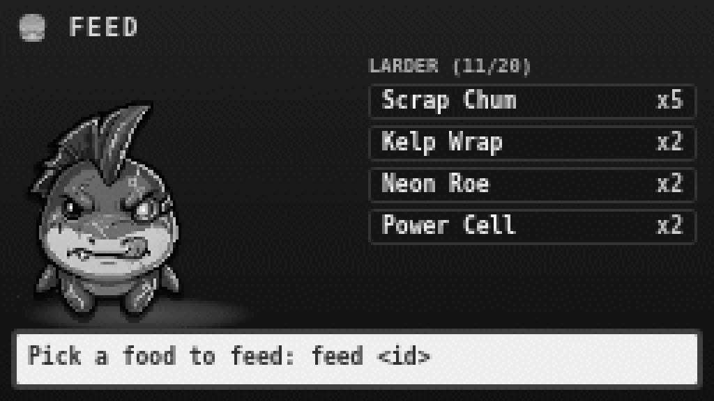 | 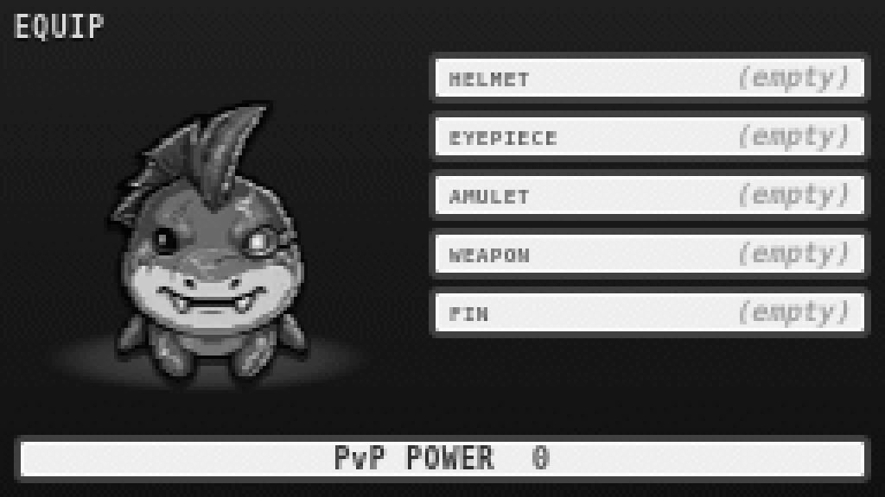 | 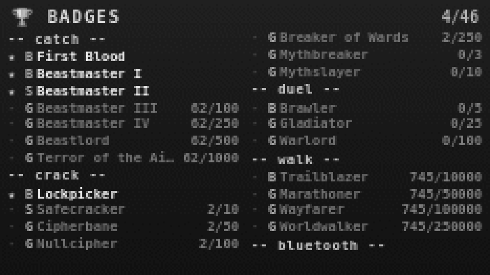 |

**Net-gun capture** — the animation frames, on-panel:

| aim | net | listen | GOTCHA |
|:---:|:---:|:---:|:---:|
| 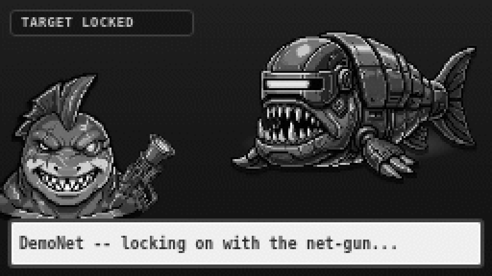 | 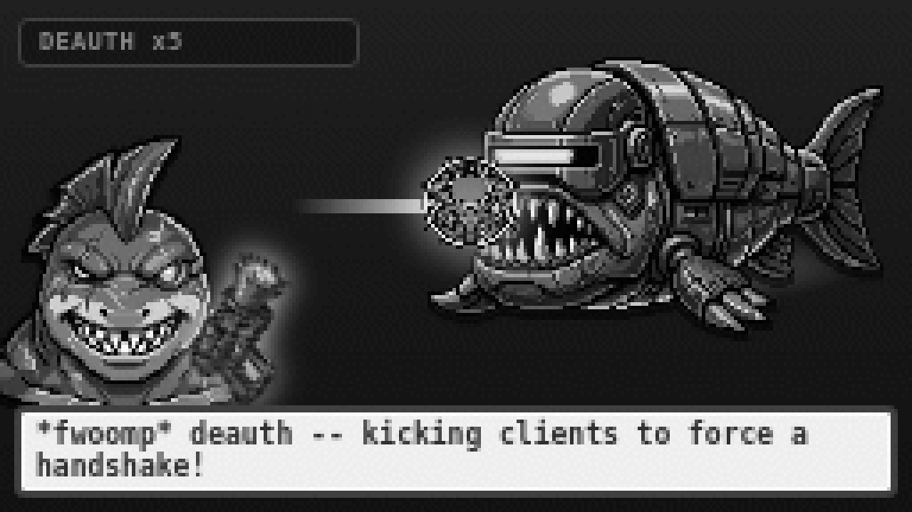 | 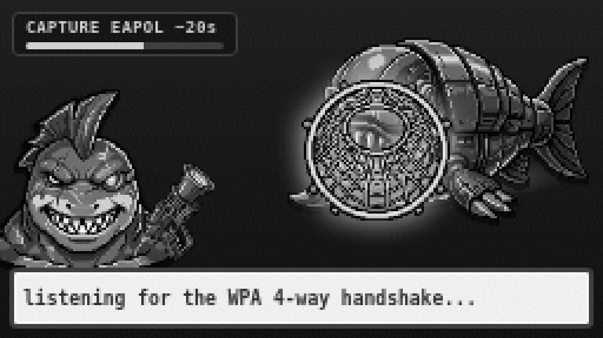 | 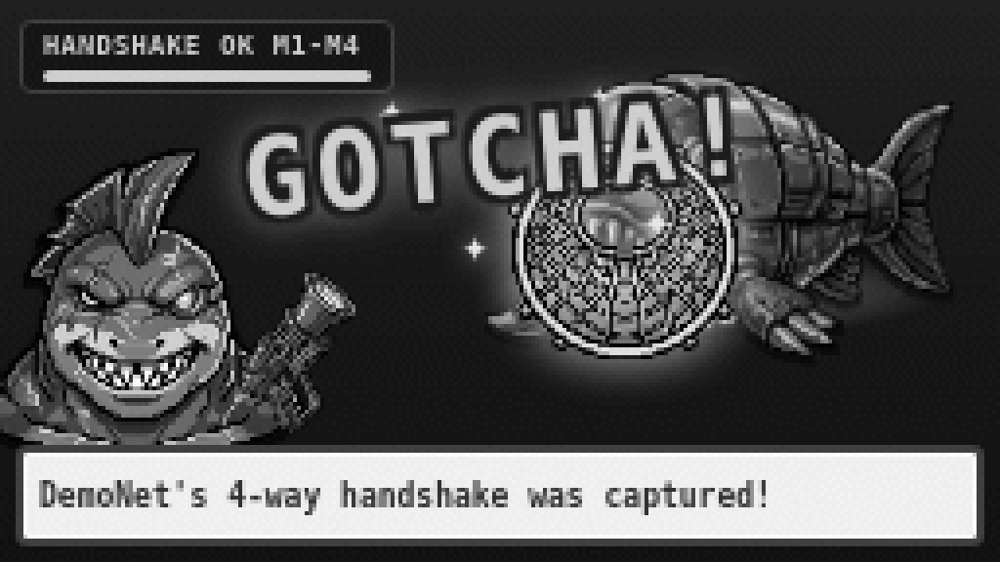 |

### Colour showcase

The layouts above are the same ones in these fuller-resolution colour renders
(the source art is colour; the device desaturates it). The full loop: **scan for
APs → target one → net its handshake → it lands in your dex** (the sprite swaps
with the action):


| Idle | Equipped gear shows on the pet | Hungry |
|:---:|:---:|:---:|
|  |  |  |

**Action faces** — the pet's image changes by mood/action: idle · happy · chomp
(catching) · hungry · sleeping · hurt. **Every evolution stage** has the full set,
so the pet emotes at any age:


**Evolutions** — egg → hatchling → juvenile → adult (L14) → prime (L20) →
alpha (L25) → legend (L40). The curve was retuned (`level_exp = 1.4`) so an
evolution lands **roughly weekly** early on and legend is reachable in **weeks,
not a year**. Past L40 the pet keeps levelling and banks a **paragon** marker
every 10 levels (non-destructive, no reset).


> **Honest art note:** `adult` reuses the shipped adult art, and the `prime`
> sprites are **programmatically-derived placeholder art** (auto-generated from
> the alpha set by `tools/gen_prime_sprites.py`) pending **final hand-drawn
> `prime` / `<variant>-prime` sprites**. They ship and read on the panel, but
> they're a placeholder.

**Shark species** (`--variant` / `character_variant`): classic · hammerhead ·
goblin · sawshark · whaleshark — distinct silhouettes that read on the mono
screen, *not* recolours:


…and your chosen species **persists through every evolution** (e.g. hammerhead,
egg → legend)…


…right down to its **own egg** — each species hatches from a distinct shell:


**The monsters** — WiFi APs are catchable creatures, **species by the router's
brand** (Netgear, TP-Link, Linksys, ASUS, Cisco, ISP…), with **WEP & WPA1** as
rare **legendaries**. Bluetooth devices are a friendlier **mini-monster** tier —
whimsical "signal-sprites" you befriend rather than exploit (more below):


**Encounter → capture** — a "A wild … appeared!" card, then a net-gun animation
that mirrors the real flow (lock → **deauth** → listen for the WPA 4-way
handshake → **GOTCHA**, or time out with no handshake):


| Handshake captured | No handshake (timed out) |
|:---:|:---:|
|  |  |

**Battle Dojo** — `battle` opens a menu: **AUTO** cracks every fresh target,
**MANUAL** scrolls a list to pick one (Flipper One: OK opens · Up/Down move · OK
selects · Back exits):


**PvP duels & equipment** — `duel` renders a 1v1 with a live blow-by-blow;
`gear` shows your pet **wearing** its loadout with total PvP power:

| Duel | Equipment |
|:---:|:---:|
|  |  |

**Progression, food & trophies** — hunger is a real survival loop: walking
forages **typed food** into a capped **Larder** you hand-feed (`feed`); a tiered
badge wall with hidden secrets (`achievements`) mints **titles** you can wear;
and the rarest catches are **✨ shiny** (~1/256):

| Feed & Larder | Badge wall | Shiny catch |
|:---:|:---:|:---:|
| 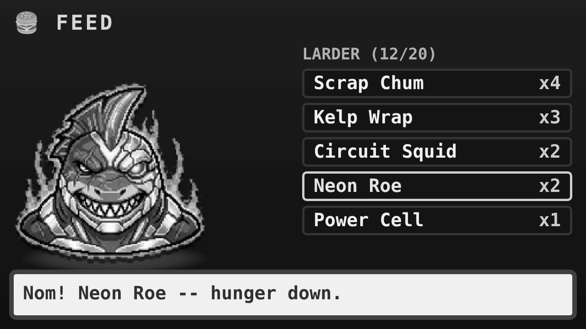 | 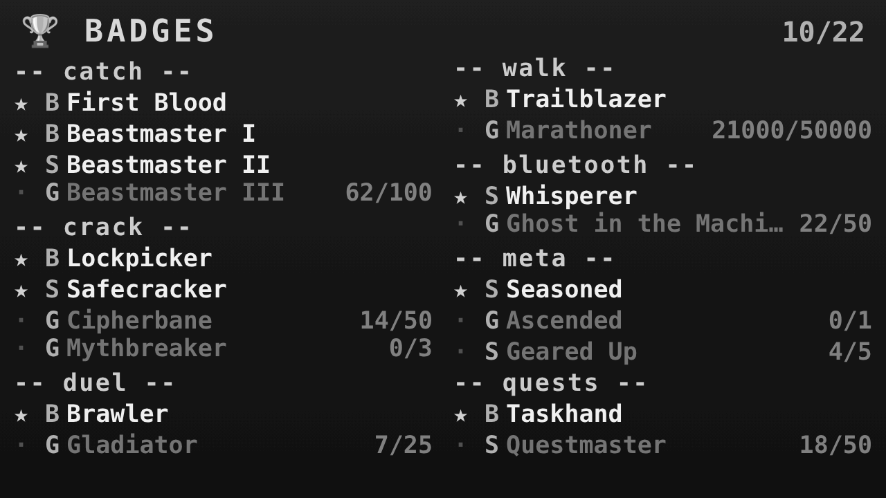 | 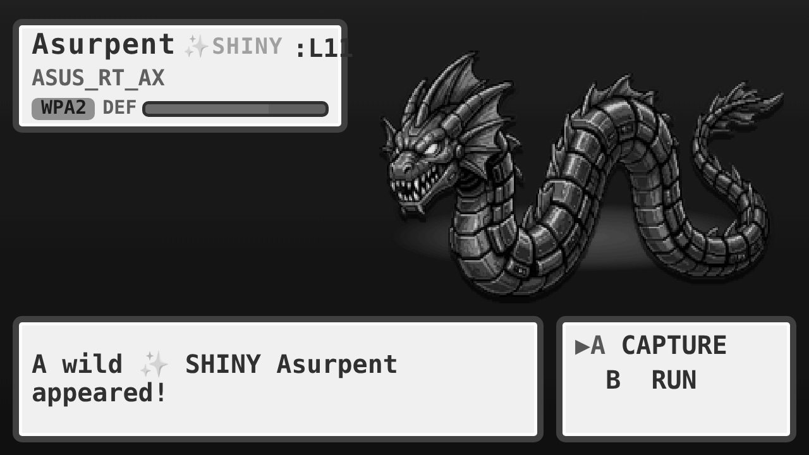 |

**Hardcore mode** (`--reset --hardcore`) — opt in once, locked for the pet's
life. The pet wears an **HC** badge, takes **Doom-style battle damage** (a bloody
nose runs down its face as HP falls), and gets a **death runway** of escalating
**STARVING** warnings before **permadeath** — let it starve and it's reborn as an
egg with a gravestone/epitaph, all progress gone. Normal-mode pets can get sick
but never die:

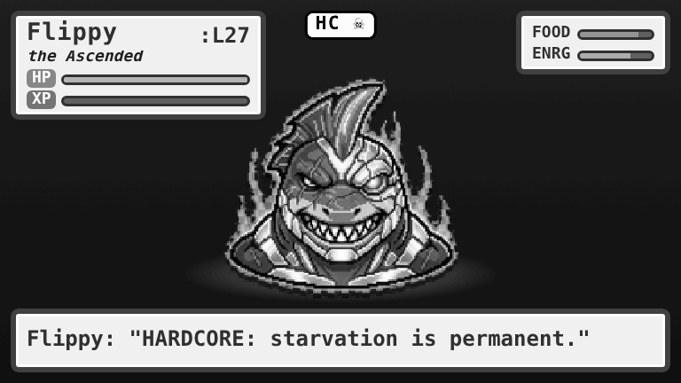

> ⚠️ **Authorized use only.** Capturing / deauthing / cracking is for networks you
> own or are explicitly permitted to test — same as any WiFi audit tool. The
> consent gate, scope gate, `--dry-run`, and audit log below are all enforced.

> 🤖 **Built with AI assistance.** I designed and directed this, but it was built
> hand-in-hand with an AI coding assistant, and the original pixel art is
> AI-generated (Google Gemini `gemini-3-pro-image`, then background-keyed to true
> alpha). The ideas and direction are mine; much of the implementation was
> AI-assisted. If AI-assisted code isn't for you, no hard feelings — feel free to
> give this one a miss. Otherwise, contributions and feedback are very welcome. 🙏

---

## Run it now (no hardware)

Everything runs on a normal Linux box in **simulation mode** — fake WiFi + GPS +
BLE events drive the real game loop, so you can raise the shark before a Flipper
One exists on your desk. The core is **pure Python 3.10+ stdlib**, no deps.

```bash
cd flippergotchi
pip install -e .                   # optional: installs the `flippergotchi` command
./run-dev.sh                       # live full-screen pet, fast-forwarded
# or, with no install (pure stdlib):
python3 -m flippergotchi --simulate --plain --ticks 60   # log-only, no clear
```

While it runs it writes a **256×144 LCD mock-up** to `/tmp/flippergotchi/*.html` —
open it in a browser to preview the on-device view. To regenerate the
device-accurate grayscale renders in `docs/device/`:

```bash
make previews-deps    # one-time: Playwright + WebKit (dev/CI only, not a runtime dep)
make previews         # drive --simulate → render HTML → 256×144 WebKit → 6-bit + dither
```

Run the tests:

```bash
python3 -m pytest -q
```

---

## Gameplay & mechanics

### The dex is a real collection

`dex` shows a **species collection** — one row per species with a **count**,
**best level**, and a **✨ shiny** flag — and a running **"caught X of 19
species"** total. Under the hood the bestiary is still keyed strictly by
**BSSID**, so the same AP is never double-counted and two hidden networks never
collapse into one; the display just rolls them up by species. Catching every
species is a finite goal that mints the capstone title **"the Reefmaster."**

### Combat actually matters

The RPG cluster is wired into the pet's daily life, not an orphan side-mode:

- **Duels resolve from real inputs** — equipped gear's **ATK / DEF / LUCK**,
  **gear-set bonuses**, and your **element** (Spark / Tide / Gale / Aether) all
  feed the resolver. LUCK is a viable build (it drives crits and initiative),
  not a trap stat.
- **The pet auto-duels detected peers**, but only ones matchmatched to a **fair
  fight** (estimated win chance in a `[0.2, 0.85]` band) — an occasional,
  competitive payoff, not a firehose of log spam.
- **`duel <name>` shows you the odds before you commit** — resolver-accurate win
  % (Monte-Carlo'd from the actual duel, not a cheap ratio) plus the element
  matchup note.
- **No 0%/100% locks** — the winner is rolled from the final HP share and clamped
  to `[0.05, 0.95]`, so favourites stay favoured but an underdog always has a
  shot.
- **Stakes:** the loser forfeits a slice of **handshakes** and its weakest
  *unequipped* gear (equipped pieces are protected).

**Cracking is different.** WiFi cracking stays a **deterministic, tool-based
act** — a wordlist attack whose odds come from the network's security, never from
gear or stats. Gear only matters in PvP.

### Walking, food & survival

- **Walking forages typed food** (Scrap Chum → Power Cell) into a capped
  **Larder** you hand-feed with `feed`. Foraging is tuned as a **periodic reward,
  not a firehose** (`forage_food_per_m = 0.01`), and the pet only auto-eats when
  genuinely hungry — so the larder and `feed` actually matter.
- **Soft stakes (normal mode):** leave the pet neglected long enough (~6 h of
  cumulative neglect) and it falls **sick** — XP stalls, it refuses to forage,
  and happiness is capped — until you feed it back to health. Normal-mode health
  is floored, so **it cannot die**; the stakes are care, not loss.
- **Hardcore mode** (opt-in once, locked for life): starvation is **permadeath**,
  but with a **runway** of escalating warning frames and a **gravestone/epitaph**
  before it's reborn as an egg.

### Endgame & retention

- **Extended badge ladders** (Beastmaster / Safecracker / Gladiator / Trailblazer
  / Whisperer / Questmaster…) with hidden secrets, live progress bars, and a
  grayscale badge wall.
- A **finite species-completion capstone** — catch all 19 → "the Reefmaster."
- A **shiny ladder** (first shiny → 5 → 15 → 50).
- **Escalating clear-streak rewards** at 7 / 14 / 30 / 100 days.
- A **rotating weekly challenge** and **month-scale quest chains**.
- **Post-L40 paragon** prestige markers (non-destructive) and aspirational
  wearable **titles**.

### BLE: signal-sprites you befriend

Bluetooth devices are the friendlier mini-monster tier. The tone is deliberately
**whimsical, not surveillance** — you *win over* shy "signal-sprites" with actions
like **LISTEN / GREET / HUM / EASE / ATTUNE / BOOP → FRIEND**, and they leave you
small trinkets. This is *not* real-device exploitation.

The one thing kept sharp is the **unwanted-tracker / stalker alert**: if a device
follows you across scans, Flippergotchi flags it — a genuine protective safety
feature, never about exploiting anyone else.

### Onboarding

A fresh pet (`--reset`) **prompts you to name it**, plays a one-time **hatch
beat** ("*crack* — {name} hatched from its egg!") with two lines of how-to-play,
and **suppresses the hashcat/analyst jargon for the first few catches** so the
opening reads like a pet, not a pentest console.

---

## CLI

```bash
python3 -m flippergotchi --simulate        # run: walk, encounter, capture, collect
python3 -m flippergotchi encounter         # demo one encounter (popup + animation)
python3 -m flippergotchi dex               # species collection: caught X of 19
python3 -m flippergotchi profile           # your pet's "life so far" summary
python3 -m flippergotchi battle            # open the Battle Dojo (auto/manual menu)
python3 -m flippergotchi battle Linksys    # MANUAL: crack one (after the warning)
python3 -m flippergotchi battle --all      # AUTO: battle every fresh captured target
python3 -m flippergotchi battle --all --dont-show-again   # ...and stop warning me
python3 -m flippergotchi quests            # daily + weekly + monthly chains + streak
python3 -m flippergotchi duel ByteSurf     # PvP duel (shows odds + element matchup)
python3 -m flippergotchi gear              # inventory / equip loadout
python3 -m flippergotchi doctor            # preflight: tools/iface/wordlist/scope
python3 -m flippergotchi scan              # passive AP discovery (no active actions)
python3 -m flippergotchi --dry-run capture AA:BB:..  # capture+validate, no deauth
python3 -m flippergotchi --capture-timeout 45 capture AA:BB:..   # longer listen window
python3 -m flippergotchi --dry-run battle MyAP --authorized   # crack path, no hashcat
python3 -m flippergotchi cloud                    # cloud status + queued captures
python3 -m flippergotchi cloud submit MyAP --authorized   # upload to wpa-sec
python3 -m flippergotchi cloud results            # pull recovered keys into the dex
python3 -m flippergotchi achievements      # tiered badge wall + progress + scrap
python3 -m flippergotchi shop              # browse; `shop buy <id>` to spend scrap
python3 -m flippergotchi shop buy ration --stash   # stash bought food in the larder
python3 -m flippergotchi feed              # larder + hunger; `feed <id>` to hand-feed
python3 -m flippergotchi title             # earned titles; `title <name>` to wear one
python3 -m flippergotchi --reset --hardcore    # new pet, PERMADEATH on starvation
python3 -m flippergotchi --simulate --manual   # choose [A]Capture/[B]Run yourself
python3 -m flippergotchi --simulate --variant hammerhead   # pick your shark species
```

- **One scrap economy**: cracking (120), duel wins (60), catching (8), OPEN
  networks (18, catch-tier — *not* a full crack), walking and quests all pay
  **scrap** — spend it in the `shop` on food, repair, lures, a gear reroll, or the
  **5000-scrap Golden Fin Skin** cosmetic sink.
- **Quests**: daily (weighted, never two on one metric) + a **rotating weekly
  challenge** + **month-scale story chains** with named givers. Clearing every
  daily builds a **streak** with rewards at 7/14/30/100 days.
- **Element type-advantage**: every fighter has an element; matchups tilt duel
  odds (`game/elements.py`).
- Every battle is logged to `game/ledger.py` (win = cracked, loss = failed,
  escalate = uploaded to the cloud cracker).

---

## The WiFi penetration stack

The radio side is built to be **rock-solid and safe**: pluggable backends, real
handshake *validation* (not just "we wrote a file"), a hard authorization gate on
every active action, and a `doctor` that tells you exactly what's missing.

```
core/wifi/monitor.py    monitor-mode iface mgmt: MT7921 detect, airmon-ng / iw,
                        rfkill, regdomain, channel set + hop plans, capabilities()
core/wifi/scan.py       passive AP/client discovery (iw scan / airodump CSV)
core/wifi/capture.py    handshake + PMKID capture: hcxdumptool → scapy fallback,
                        AUTHORIZED targeted deauth only; honors --dry-run
core/wifi/backends.py   CaptureBackend abstraction; make_backend() auto-selects
                        native → bettercap → sim, forwarding the authz gate to ALL
core/handshake.py       validate EAPOL 4-way (M1–M4) / PMKID before cracking —
                        pure-python pcap/pcapng parser, no external tool needed
game/cracking.py        hashcat -m 22000 (PMKID/EAPOL), multi-wordlist + rules,
                        structured CrackResult; deterministic sim fallback
core/authz.py           Authorizer: JSONL audit of every deauth/capture/crack/ble
```

- **Only crackable networks are surfaced** (open / WEP / WPA / WPA2-PSK). WPA3,
  WPA2-Enterprise and OWE aren't wordlist-crackable, so they aren't shown.
- **WEP & WPA1 are rare LEGENDARIES** (Wepwraith / Wparchon) — legacy security is
  trivially broken, so they're a prized catch and crack **on the fly** in the
  field (still consent- *and* scope-gated).
- **Battling WPA2 = cracking at home**: capture the handshake, then
  `hashcat -m 22000` + rockyou; if it survives and you allow it, escalate to a
  **cloud crack** (real wpa-sec upload; `cloud results` pulls keys back).

### Safety & authorization (enforced end-to-end)

The consent/scope discipline the project advertises is **actually enforced in
code**, and covered by `tests/test_p0_safety.py`:

- **Consent-gated capture on ALL backends.** `make_backend()` forwards the
  authorization gate to the **bettercap** backend as well as native — and it
  **fails closed** (passive-only) if the gate is missing or errors, so the
  default path can't silently deauth.
- **`--dry-run` is honored on the real paths.** Monitor mode, passive scan,
  capture-listen, handshake validation and hashcat command *construction* all
  run — but the two irreversible/expensive actions (deauth injection and actually
  running hashcat) are suppressed. Walk the whole stack with a monitor-mode dongle
  without transmitting.
- **On-the-fly cracking is scope-gated.** Field cracking requires **both** a scope
  check (`in_scope` against your `home_networks`, or a manual pick) **and** the
  one-time consent — dismissing the warning does *not* let the daemon crack
  anything it happens to catch.
- **The autonomous loop is audited.** The agent's deauth, crack, and active BLE
  actions are written to `~/.flippergotchi/audit.log` (JSONL), not just the
  standalone CLI commands.
- **SSIDs are sanitized.** Attacker-controlled SSIDs are stripped of control/ANSI
  characters and length-capped before they reach any prompt, log line, or the
  256×144 display (limiting terminal-injection and prompt-injection surface; the
  default `canned` backend has no LLM at all).
- **No weak default creds ship.** `bettercap_user` / `bettercap_pass` and cloud
  API keys default to empty — leaving them unset keeps live capture disabled
  rather than shipping guessable credentials.

**Preflight.** `python3 -m flippergotchi doctor` reports tools
(`hcxdumptool`/`hcxpcapngtool`/`hashcat`/`iw`/…), privileges (root / CAP_NET_ADMIN
/ CAP_NET_RAW), the monitor interface and the wordlist — then a plain-English
"you can: [passive scan] [capture] [crack]" summary with fix-it hints.

---

## AI backends

Set `ai_backend` in config (or leave the default):

- **`canned`** — phrase pools, no dependencies. The default; always available.
  Pools are widened (6–8 lines each) and the pet now speaks at **every** payoff
  (catch, quest-clear, badge, crack, shiny, sickness, starvation).
- **`cpu`** — a small GGUF (e.g. Qwen2.5-1.5B-Instruct) via `llama-cpp-python`.
  Runs today on the RK3576 A72 cores. Set `ai_model_path`. **This is the
  launch-day path** (install `pip install ".[ai-cpu]"`).
- **`npu`** — Rockchip **RKLLM** runtime on the 6 TOPS NPU. Still a **stub**
  pending the mainline RK3576 NPU driver
  ([tracking issue #55](https://github.com/flipperdevices/flipperone-linux-build-scripts/issues/55));
  `build_backend()` falls back automatically, so nothing breaks before then.

The whole point of the abstraction: **ship on `canned`/`cpu` now, flip to `npu`
later with no redesign.**

---

## Hardware reality (Flipper One)

A read-only implementation review ([`docs/flipper-one-implementation.md`](docs/flipper-one-implementation.md))
checked the project's assumptions against Flipper's published specs. Most of the
core bets held up; two need correcting, and they're reflected above.

| Assumption | Reality | Verdict |
|---|---|---|
| 256×144, 6-bit grayscale LCD | Exactly correct | ✅ |
| Wi-Fi = MT7921 monitor mode | MediaTek MT7921AUN, mainline mt76/nl80211 | ✅ |
| BLE via BlueZ | Bluetooth 5.2, standard BlueZ | ✅ |
| UI = author HTML/CSS, render on device WebKit | **FlipCTL is real**: HTML/JS/CSS on headless **WebKit-on-DRM** | ✅ the UI bet was right |
| NPU 6 TOPS, RKLLM stubbed pending driver | Correct; NPU driver not mainlined yet | ✅ de-risked |
| Ship as a "FlipCTL plugin" | FlipCTL plugins are D-pad menu wrappers around CLI tools; the immutable OS ships apps as **Flatpak/AppImage** | ⚠️ delivery model, not renderer |
| GPS via `gpsd` as a core mechanic | **No onboard GPS and no IMU** in any published spec | ⚠️ needs an external source |

- **The UI bet was right.** FlipCTL renders HTML/JS/CSS on headless WebKit on DRM
  at exactly our target — so authoring HTML at 256×144 grayscale is correct. What
  changes is *delivery*: a full-bleed animated game is most likely a **sandboxed
  full-screen WebKit app packaged as Flatpak/AppImage**, not a FlipCTL "plugin"
  (FlipCTL is the renderer/HMI framework). See
  [`docs/ui-render-through.md`](docs/ui-render-through.md) and the runnable
  `tools/shoot.py` WebKit render harness.
- **Movement needs an external source.** With no onboard GNSS or IMU, the walking
  economy can't come from the device alone. `pet/gps.py`'s `gpsd` reader is fully
  implemented (and sanity-clamps fixes: mode ≥ 2, accuracy-gated, teleport-drop,
  speed cap) — it just needs an **external USB/UART GPS** or an **M.2 GNSS
  module**. A Wi-Fi/BLE-scan activity heuristic and play-based progression are
  proposed as the accessory-free baseline. See
  [`docs/movement-mechanic.md`](docs/movement-mechanic.md). (The old "IMU
  pedometer" idea is dropped — there's no IMU.)

### Deploy & package

- **Service:** run unattended via the shipped systemd unit
  (`packaging/flippergotchi.service`) with `Restart=on-failure`,
  `AmbientCapabilities=CAP_NET_ADMIN CAP_NET_RAW`, `StateDirectory=`, and clean
  SIGTERM saves. A **config search path** (`-c` → `$FLIPPERGOTCHI_CONFIG` →
  `./flippergotchi.toml` → `~/.config/…` → `/etc/…`) means no `-c` flag is needed.
  See [`docs/deployment.md`](docs/deployment.md).
- **Install extras:** `ai-cpu` (CPU LLM), `ble` (bleak/BlueZ peer discovery),
  `wifi` (scapy 802.11 parsing); the core is stdlib-only. `aarch64` wheels and CI
  are covered in [`docs/packaging.md`](docs/packaging.md).

### Porting to real hardware (when it arrives)

The game logic in `pet/` and `agent.py` does **not** change between sim and
hardware — that's the design. Every hardware path is tagged
`NEEDS ON-HARDWARE VALIDATION` and degrades to sim/None rather than crashing:

1. **Capture:** install `hcxdumptool`/`hcxpcapngtool`/`hashcat`, set
   `simulate = false`, run `doctor` until green, agree to the on-screen warning,
   and point `interface` at the MT7921 monitor iface. `make_backend()` picks the
   native stack (or set `capture_backend = "bettercap"`).
2. **Walking:** attach an external GPS, run `gpsd`, set `gps_mode = "gpsd"` — or
   pick another movement source per `docs/movement-mechanic.md`.
3. **UI/input:** settle the delivery model (Flatpak/AppImage full-screen WebKit
   app, pending SDK confirmation) and wire the D-pad/soft-buttons.
4. **AI:** convert a sub-3B model to `.rkllm`, finish `ai/rkllm_npu.py`, set
   `ai_backend = "npu"`.

---

## Docs (deep dives)

| Doc | What it covers |
|---|---|
| [`docs/flipper-one-implementation.md`](docs/flipper-one-implementation.md) | Full hardware reality check + implementation review/roadmap |
| [`docs/gameplay-review.md`](docs/gameplay-review.md) | The five-lens "fun but functional" design review that drove this pass |
| [`docs/playtest-notes.md`](docs/playtest-notes.md) | Empirical tuning: care timing, combat odds, evolution curve |
| [`docs/movement-mechanic.md`](docs/movement-mechanic.md) | Movement-source options (no GPS/IMU) + recommendation |
| [`docs/ui-render-through.md`](docs/ui-render-through.md) | WebKit render harness + Flatpak-vs-plugin delivery decision |
| [`docs/deployment.md`](docs/deployment.md) | systemd service, config search path, state dir, clean shutdown |
| [`docs/packaging.md`](docs/packaging.md) | Extras, aarch64 `llama-cpp-python` wheels, sdist/wheel, CI |
| [`docs/device/README.md`](docs/device/README.md) | How the device-accurate previews are made + fidelity caveats |

---

## Roadmap / status

**Done and in the loop:** species-dex collection + Reefmaster capstone · retuned
evolution curve (weekly-ish, legend in weeks) + paragon prestige · normal-mode
soft-stakes sickness · hardcore death runway + epitaph · combat wired to
gear/element/set-bonuses with fair-fight auto-duels, resolver-accurate odds and an
upset floor · widened AI voice at every payoff · retuned economy with real sinks ·
friendly BLE reskin (with the tracker safety alert kept) · onboarding · end-to-end
safety enforcement (consent/scope/dry-run/audit/sanitize) · native capture stack,
handshake/PMKID validation, hashcat + cloud crack, `doctor` preflight · systemd
deploy + config search path + aarch64 packaging · device-accurate render previews.

**Implemented but unvalidated (need a device):**
- `core/wifi/*` native capture · `core/bettercap.py` live REST client
- `pet/gps.py` gpsd reader (requires an **external** GPS/GNSS)
- `core/bluetooth.py` BLE scan via optional `bleak`

**Still open (blocked on a decision or on hardware):**
- Device UI/input layer + app-delivery model (Flatpak/AppImage vs FlipCTL) — see
  `docs/ui-render-through.md`
- Accessory-free movement source (scan-based activity heuristic) — see
  `docs/movement-mechanic.md`
- RKLLM NPU backend (blocked on the mainline driver, issue #55)
- **Final hand-drawn `prime` sprites** to replace the derived placeholders
- Nice-to-haves: RL channel hopper as an optional capture optimizer; trade/share
  your dex; co-op "raids" over BLE

---

## License

[MIT](LICENSE) © 2026 haroldboom. Built with AI assistance (see the note at the
top). Use the WiFi/Bluetooth capabilities only on networks and devices you own or
are authorized to test.

## Trademarks & affiliation

Flippergotchi is an **independent, unofficial fan project**. The character art is
original art; the shark species are original designs *inspired by* real sharks and
classic '90s shark-toon characters but use generic descriptive names and original
artwork — those characters are trademarks of their respective owners and aren't
used here. It is also **not affiliated with, endorsed by, or sponsored by Flipper
Devices Inc.** "Flipper", "Flipper One", and the Flipper dolphin are trademarks of
Flipper Devices Inc., used here only **nominatively** to indicate the target
hardware. **No official Flipper Devices artwork, renders, logos, or insignia are
included in this repository** — the device mock-up is original art. Flipper
Devices' brand policy requires written authorization to use their marks/assets, so
if you fork or redistribute this, keep it clearly unofficial. The MIT license
covers this project's own code and art only.
</content>
</invoke>
