# Flippergotchi 🐬

[](https://github.com/haroldboom/flippergotchi/actions/workflows/ci.yml)

A **Tamagotchi-style WiFi pet** for the [**Flipper One**](https://docs.flipper.net/one).
It shares Pwnagotchi's DNA — capturing WPA handshakes with the radio — but you
**scan for nearby APs and choose which to capture** (a deliberate, per-AP
mechanic — *not* indiscriminate deauth of everything in range), and the captures,
walks, and AI personality are wired into a *pet you raise* instead of a pwning
machine.

> 📟 **This is for the Flipper One — NOT the Flipper Zero.** The Flipper One is
> the new, **unreleased** Rockchip RK3576 Arm-**Linux** handheld (Wi-Fi 6E +
> 6 TOPS NPU + FlipCTL UI) — a full Linux computer, not the Zero's
> microcontroller. The hardware isn't out yet, so today this runs entirely in
> **simulation** on any Linux box; the radio/GPS/Bluetooth/NPU hooks are
> clearly-marked TODOs that light up when the device ships.
>
> 🖥️ **The screen is a 256×144 monochrome LCD, 64-level grayscale (6-bit)**
> ([official specs](https://docs.flipper.net/one/general/tech-specs)) — so every
> render below is **grayscale**, exactly what the panel shows. (The source sprites
> are colour and are auto-desaturated for the device.)

- **WiFi APs are monsters you catch.** Each access point is a creature; net its
  handshake to add it to your **bestiary** (creature-collector style) — *not* food.
- **Walking is the fitness core.** GPS movement → XP → levels → evolutions
  (egg → hatchling → … → legend), and your shark **forages food** (and, rarely,
  gear) as you walk — that's how the pet actually stays fed.
- **Crack & duel for loot.** Cracking a captured monster (after a one-time warning) or duelling a
  rival Flippergotchi drops **equipment** you can equip.
- **The onboard AI is its voice.** The RK3576 NPU (or a CPU model, or canned
  phrases) narrates what the pet feels and what it just caught.
- **A cyberpunk pixel-art shark character** in an **old-school
  creature-collector 2D HUD**, at the Flipper One's native **256×144**. It **evolves**
  egg→legend and comes in 5 **shark species** (different silhouettes, picked with `--variant`).

> **The economy at a glance:** walk → forage *food* (+ rare gear) · encounter →
> *catch* AP-monsters · crack → *loot* + score · duel rivals → *steal*
> gear & handshakes. APs are monsters; food comes from foraging.

### What it looks like

The game on the Flipper One's **256×144** screen — a retro creature-collector HUD
(HP / XP / food / energy + dialogue box) with the cyberpunk shark, scaled crisp
with nearest-neighbour. The full loop: **scan for APs → target one → net its
handshake → it lands in your bestiary** (the sprite swaps with the action):

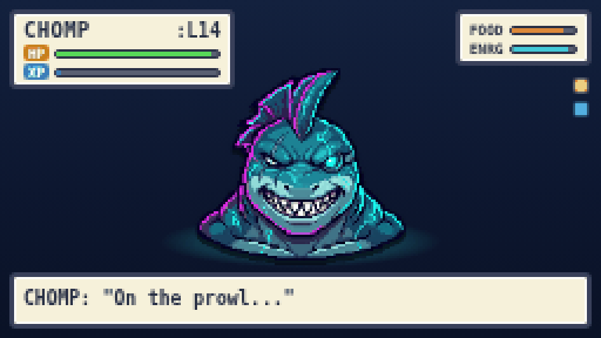

| Idle | Equipped gear shows on the character | Hungry |
|:---:|:---:|:---:|
| 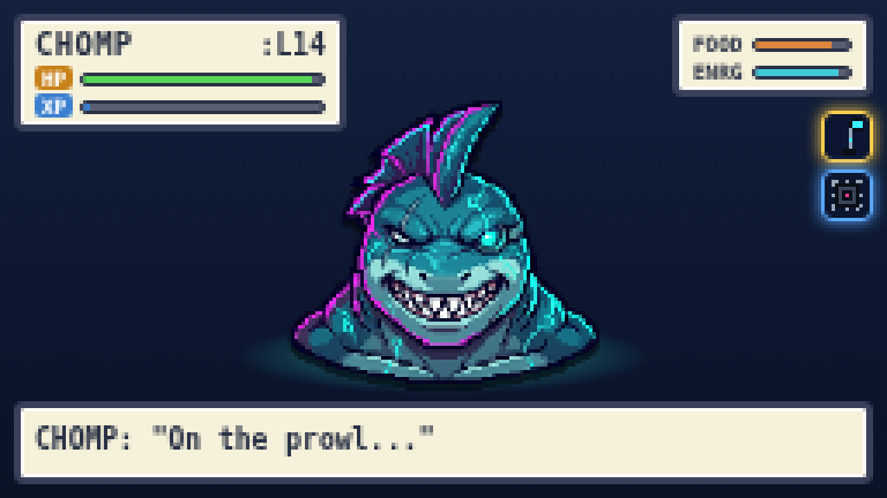 | 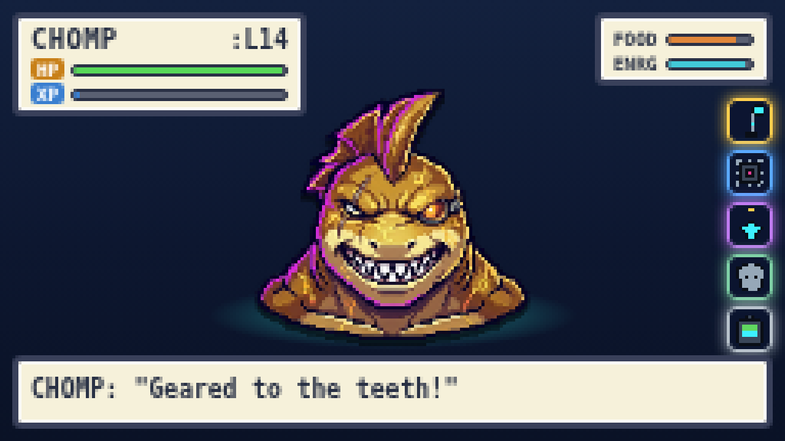 | 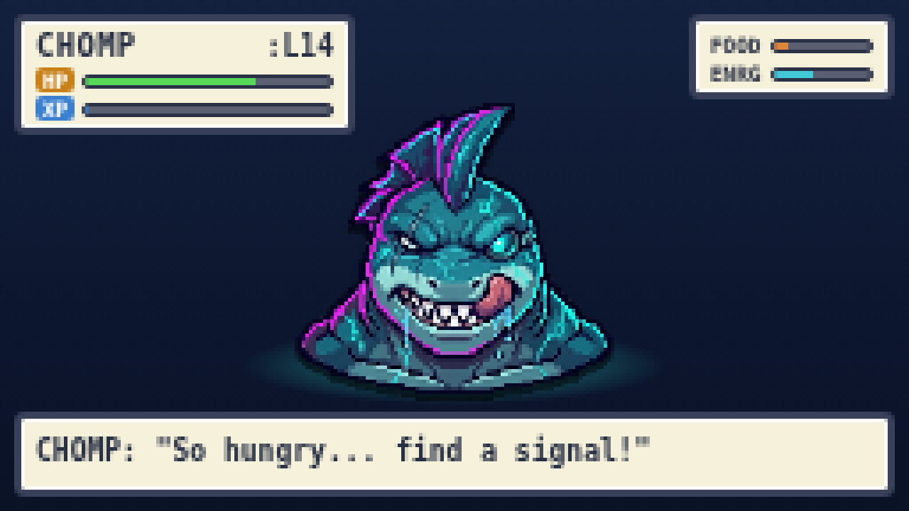 |

**Action faces** — the character image changes by mood/action: idle · happy · chomp
(catching) · hungry · sleeping · hurt. **Every evolution stage** has the full set
(hatchling → legend), so the pet emotes at any age:

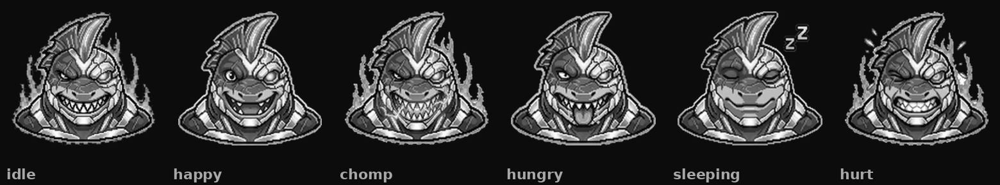

**Evolutions** — egg → hatchling → juvenile → alpha → legend:

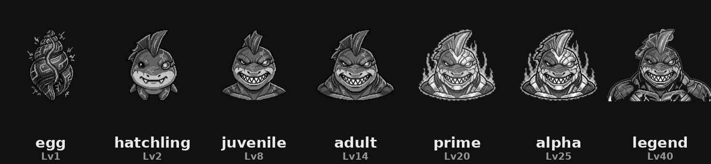

**Shark species** (`--variant` / `character_variant`): classic · hammerhead · goblin · sawshark · whaleshark — distinct silhouettes that read on the mono screen, *not* recolours

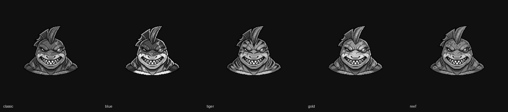

…and your chosen species **persists through every evolution** (e.g. hammerhead, egg → legend):

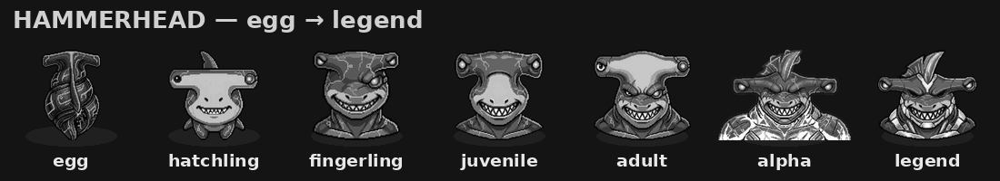

…right down to its **own egg** — each species hatches from a distinct shell:

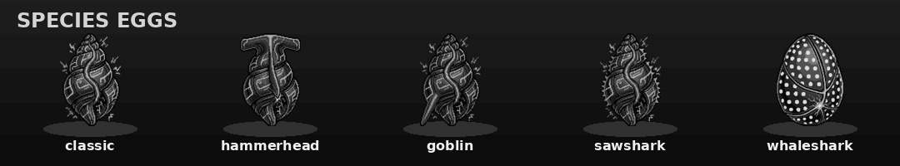

**The monsters** — WiFi APs are catchable creatures, **species by the router's
brand** (Netgear, TP-Link, Linksys, ASUS, Cisco, ISP…), with **WEP & WPA1** as
rare **legendaries**. Bluetooth devices are a friendlier **mini-monster** tier
(phones, wearables, audio, beacons, computers, trackers, HID, smart-home,
medical):

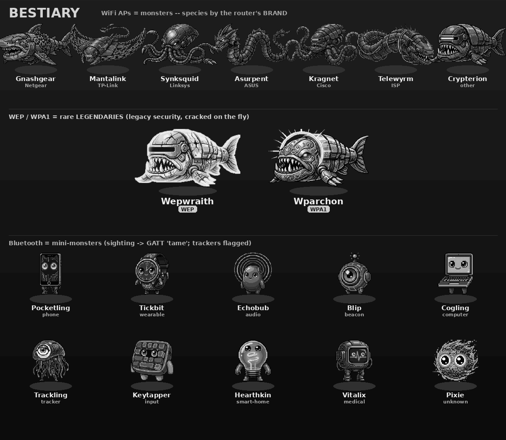

**Encounter → capture** — a "A wild … appeared!" card, then a net-gun
animation that mirrors the real flow (lock → **deauth** → listen for the WPA
4-way handshake → **GOTCHA**, or time out with no handshake):

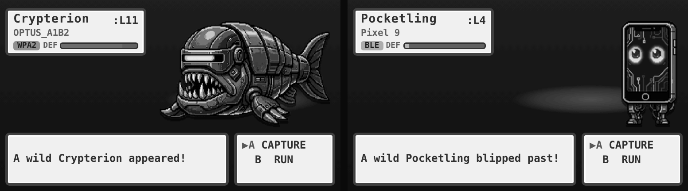

| Handshake captured | No handshake (timed out) |
|:---:|:---:|
| 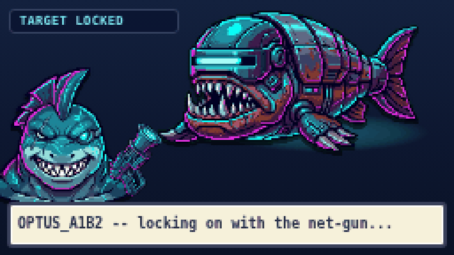 | 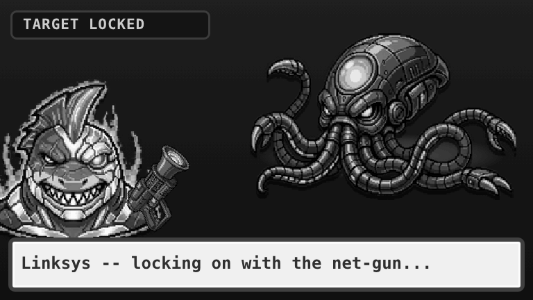 |

**BLE battling** — Bluetooth monsters battle too, as a short sequence of real
attack techniques: **SNIFF** the connection → **RE-PAIR** to force a fresh
exchange → **BRUTE TK** with **crackle** to recover the LTK and *own* it. A
secure (LE Secure Connections) target isn't always immune — a **KNOB entropy
DOWNGRADE** can weaken it to a brute-forceable key, or you can **GATT-WRITE** to
take control (ring a tracker, toggle a bulb). Owning a device yields its LTK plus
class-specific **intel** (location history, audio intercept, health records…).

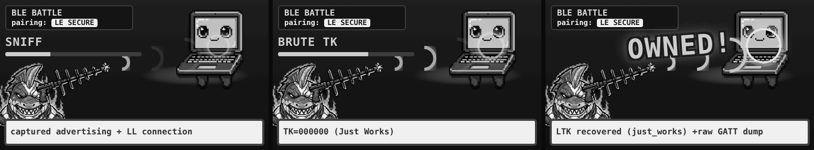

**Battle Dojo** — `battle` opens a menu: **AUTO** cracks every fresh target,
**MANUAL** scrolls a list to pick one (Flipper One: OK opens · Up/Down move · OK
selects · Back exits):

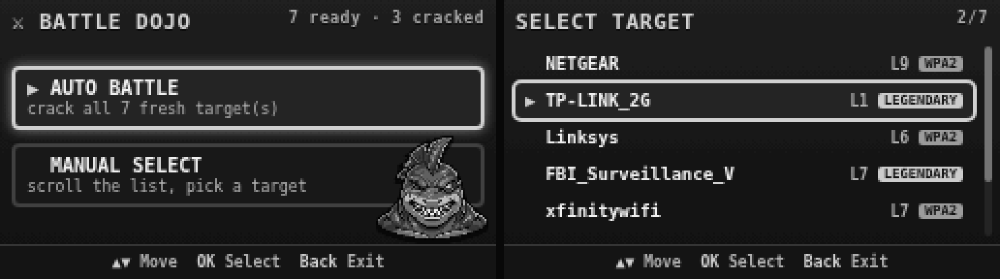

**PvP duels & equipment** — `duel` renders a 1v1 with a live blow-by-blow;
`gear` shows your character **wearing** its loadout with total PvP power:

| Duel | Equipment |
|:---:|:---:|
| 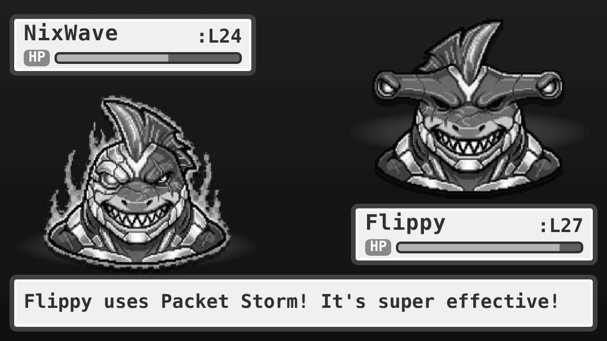 | 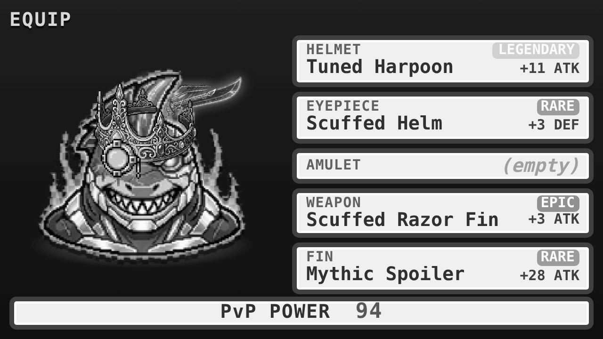 |

> ⚠️ **Authorized use only.** Capturing / deauthing / cracking is for networks you
> own or are explicitly permitted to test — same as any WiFi audit tool.

> 🤖 **Built with AI assistance.** I designed and directed this, but it was built
> hand-in-hand with an AI coding assistant, and the original pixel art is
> AI-generated (Google Gemini `gemini-3-pro-image`, then background-keyed to true
> alpha). The ideas and direction are mine; much of the implementation was
> AI-assisted. If AI-assisted code isn't for you, no hard feelings — feel free to
> give this one a miss. Otherwise, contributions and feedback are very welcome. 🙏

---

## Run it now (no hardware)

Everything runs on a normal Linux box in **simulation mode** — fake WiFi + GPS
events drive the real game loop, so you can watch the shark before a Flipper
One exists on your desk.

```bash
cd flippergotchi
pip install -e .                   # optional: installs the `flippergotchi` command
./run-dev.sh                       # live full-screen character, fast-forwarded
# or, with no install (pure stdlib):
python3 -m flippergotchi --simulate --plain --ticks 60   # log-only, no clear
```

While it runs it also writes a **256×144 LCD mock-up** to
`/tmp/flippergotchi/face.html` — open it in a browser to preview the on-device
FlipCTL view.

Run the tests:

```bash
python3 tests/test_mechanics.py    # or: python -m pytest
```

---

## Architecture

```
bettercap (radio)  ─┐
                    ├─► Agent ──► PetState (hunger/xp/level/health…)
gps (walking)      ─┘     │            │
                          │            ├─► AIService ──► [canned | cpu-llama | rkllm-npu]
                          │            │
                          └────────────┴─► view ──► [TUI text | FlipCTL HTML/LCD]
```

| Module | Role | Status |
|---|---|---|
| `core/wifi/` | native capture stack: monitor-mode mgmt, scan, hcxdumptool/scapy handshake+PMKID capture, `CaptureBackend` (auto: native→bettercap→sim) | sim ✅; hw path wired (needs on-device validation) |
| `core/handshake.py` | EAPOL 4-way / PMKID validation (pure-python pcap fallback) + `hcxpcapngtool` → hc22000 | ✅ done & tested |
| `core/authz.py` | JSONL audit log of active RF actions (deauth/capture/crack) | ✅ done & tested |
| `core/preflight.py` + `game/doctor.py` | `doctor` preflight: tools / privileges / iface / wordlist | ✅ done & tested |
| `game/cracking.py` | hardened hashcat pipeline (PMKID/EAPOL, multi-wordlist + rules) | ✅ done & tested |
| `game/blebattle.py` | BLE battling: technique sequence (sniff/re-pair/brute-TK/KNOB/control) + loot | ✅ done & tested |
| `game/achievements.py` · `shop.py` · `gearsets.py` | tiered/hidden badges + titles + gear payouts · "scrap" shop (`--stash` food → larder) · gear-set bonuses | ✅ done & tested |
| `game/food.py` · `game/larder.py` | typed foods (Scrap Chum→Power Cell) + a capped larder pantry | ✅ done & tested |
| `game/moves.py` | per-element PvP move sets + status effects | ✅ done & tested |
| `core/bettercap.py` | WiFi capture via bettercap REST | **sim works**; live wired (needs on-device validation) |
| `pet/gps.py` | GPS movement → walk distance | **sim works**; gpsd = TODO |
| `pet/mechanics.py` | hunger / **satiety** / **escalating starvation** / xp / levels / evolution / mood | ✅ done & tested |
| `pet/state.py` | the savefile (v2: satiety / titles / **hardcore** mode; `persistence.migrate`) | ✅ done & tested |
| `ai/service.py` | event + mood → spoken line | ✅ (backend-pluggable) |
| `ai/canned.py` | phrase pools, zero deps | ✅ default |
| `ai/cpu_llama.py` | local GGUF via llama.cpp | works with a model |
| `ai/rkllm_npu.py` | NPU LLM (6 TOPS) | **stub** — waits on driver |
| `view/faces.py` | shark ASCII expressions (TUI) | ✅ |
| `view/tui.py` | dev terminal view | ✅ |
| `view/flipctl.py` | 256×144 creature-collector HUD + pixel sprite | ✅ render; plugin = TODO |
| `view/battle_screen.py` | 1v1 PvP duel screen render | ✅ render |
| `view/equip_screen.py` | character-wearing-gear loadout screen render | ✅ render |
| `view/encounter_screen.py` | "A wild … appeared!" encounter card render | ✅ render |
| `view/capture_screen.py` | net-gun capture animation frames (aim→net→GOTCHA) | ✅ render |
| `view/battle_menu.py` | Battle Dojo menu + scrollable target list + button map | ✅ render |
| `view/blebattle_screen.py` | BLE battle outcome card (own / control / immune) | ✅ render |
| `view/monster_art.py` | species → enemy/mini-monster sprite lookup | ✅ done & tested |
| `view/sprites/` | cyberpunk pixel-art sprites (character + monsters) | ✅ |
| `game/analysis.py` | crack-difficulty heuristics (the analyst) | ✅ done & tested |
| `game/monsters.py` | AP/BLE → collectible monster + stats + **shiny** (~1/256, stable) | ✅ |
| `game/bestiary.py` | your captured collection (savefile) | ✅ |
| `game/battle.py` | hashcat -m 22000 + rockyou → cloud fallback, auth-gated | sim ✅; hw path wired (needs on-device validation) |
| `game/cracking.py` (CloudCracker) | real wpa-sec/onlinehashcrack upload + result retrieval | ✅ done & tested (wpa-sec validated path) |
| `game/encounter.py` | detect → Capture/Run state machine | ✅ done & tested |
| `game/home.py` | "are we home?" gate for battling | ✅ |
| `game/ledger.py` | wins / losses / escalations database | ✅ done & tested |
| `game/duel.py` | Digimon-style PvP: turn-based moves + status effects + STAB | ✅ done & tested |
| `game/equipment.py` | gear: loot, equip, forfeit-on-loss | ✅ done & tested |
| `game/elements.py` | Spark/Tide/Gale/Aether matchup chart | ✅ done & tested |
| `game/quests.py` | daily + weekly + lifetime **story chains** + clear **streak**, scrap/food/gear rewards (`migrate` v3) | ✅ done & tested |
| `view/feed_screen.py` · `view/badge_screen.py` | feeding screen (larder + hand-feed) · grayscale **badge wall** | ✅ render |
| `prefs.py` | persistent prefs (e.g. dismissed warning) | ✅ |
| `view/animations.py` | net-gun / flee ASCII animation frames | ✅ |
| `core/bluetooth.py` | BLE devices → mini-monsters | sim ✅; BlueZ = TODO |

## The RPG layer — a WiFi-pentest fitness game

It's also a location-based GPS RPG layered on the same data:

- **You level up by walking** (GPS = fitness/XP), same as the pet.
- **APs are monsters — species by the router's BRAND.** The vendor (from the
  BSSID OUI / SSID) picks the species: Netgear→Gnashgear, TP-Link→Mantalink,
  Linksys→Synksquid, ASUS→Asurpent, Cisco→Kragnet, an ISP→Telewyrm, unknown→
  Crypterion. Band = element, clients = minions.
- **WEP & WPA1 are rare LEGENDARIES** (Wepwraith / Wparchon). Legacy security is
  trivially broken, so they're a prized, easy catch — and they crack **on the
  fly** in the field (no trip home): WEP via **aircrack-ng** (IV attack, no
  wordlist), WPA1 via the handshake path. Still authorization-gated, and the
  first on-the-fly crack asks for a **one-time on-screen OK** (the same warning
  as battling, with a *don't ask again* — no config files to touch).
- **Bluetooth devices are smaller monsters** — see the BLE section above.
- **Battling = cracking.** WPA2 is the slow one: capture the handshake, then
  `hashcat -m 22000` + rockyou at home; if it survives and you allow it, escalate
  to a **cloud crack** (real wpa-sec upload; `cloud results` pulls keys back).
- **Only crackable networks are surfaced** (open / WEP / WPA / WPA2-PSK). WPA3,
  WPA2-Enterprise and OWE aren't wordlist-crackable, so they're not shown at all.

> 🔒 **Authorization is consent-based.** Cracking shows a **warning you agree to
> once** (with a *don't ask again* — no config files); on-the-fly WEP/WPA cracking
> asks the same. Crack only networks you own or are cleared to test.

### The encounter flow (location-based catching)

```
AP detected ─► POPUP "[A] Capture  [B] Run"
                 │
       ┌─────────┴─────────┐
   Capture                Run
       │                    │
  net-gun animation     flee animation
   ├─ caught  → bestiary (handshake = food for the pet)
   └─ escaped → broke free, no handshake
```

Capture success is about **radio** (clients present, signal strength) — not
encryption. *Battling* (cracking) is a separate, deliberate step you do **at home**:

```
game/encounter.py   detect → Capture/Run → caught/escaped/fled  (+ animations)
game/home.py        at_home(geofence OR home network in range) → battle unlocked
game/battle.py      hashcat+rockyou → cloud, consent-gated, with a warning
```

### CLI

```bash
python3 -m flippergotchi --simulate        # run: walk, encounter, capture, collect
python3 -m flippergotchi encounter         # demo one encounter (popup + animation)
python3 -m flippergotchi dex               # bestiary + your W/L/escalate record
python3 -m flippergotchi battle            # open the Battle Dojo (auto/manual menu)
python3 -m flippergotchi battle Linksys    # MANUAL: crack one (after the warning)
python3 -m flippergotchi battle --all      # AUTO: battle every fresh captured target
python3 -m flippergotchi battle --all --dont-show-again   # ...and stop warning me
python3 -m flippergotchi quests            # today's daily quests + progress
python3 -m flippergotchi duel ByteSurf     # PvP duel (moves + element matchups)
python3 -m flippergotchi gear              # inventory / equip loadout
python3 -m flippergotchi doctor            # preflight: tools/iface/wordlist/scope
python3 -m flippergotchi scan              # passive AP discovery (no active actions)
python3 -m flippergotchi --dry-run capture AA:BB:..  # capture+validate, no deauth
python3 -m flippergotchi --capture-timeout 45 capture AA:BB:..   # longer listen window
python3 -m flippergotchi --dry-run battle MyAP --authorized   # crack path, no hashcat
python3 -m flippergotchi cloud                    # cloud status + queued captures
python3 -m flippergotchi cloud submit MyAP --authorized   # upload to wpa-sec
python3 -m flippergotchi cloud results            # pull recovered keys into the dex
python3 -m flippergotchi achievements      # tiered badge wall + progress + scrap
python3 -m flippergotchi shop              # browse; `shop buy <id>` to spend scrap
python3 -m flippergotchi shop buy ration --stash   # stash bought food in the larder
python3 -m flippergotchi feed              # larder + hunger; `feed <id>` to hand-feed
python3 -m flippergotchi title             # earned titles; `title <name>` to wear one
python3 -m flippergotchi --reset --hardcore    # new pet, PERMADEATH on starvation
python3 -m flippergotchi --simulate --manual   # choose [A]Capture/[B]Run yourself
python3 -m flippergotchi --simulate --variant hammerhead   # pick your shark species
```

- **One scrap economy**: cracking, catching, walking, winning duels **and quests**
  all pay **scrap** — spend it in the `shop` on food, repair, lures or a gear reroll.
- **Quests** (`quests`): **daily** (weighted, never two on one metric) + **weekly**
  + lifetime **story chains** with named givers (First Steps / The Hunt / Ghost
  Protocol). Clearing every daily pays a bonus and builds a **streak**.
- **Achievements** (`achievements`): tiered **bronze/silver/gold** ladders +
  **hidden** secrets, live progress bars, and a grayscale **badge-wall** render.
  Gold capstones mint gear or a **title** you can wear (`title <name>`).
- **Hunger is food, food is real**: walking forages **typed foods** (Scrap Chum →
  Power Cell) into a capped **Larder**; `feed` hand-feeds them. Eating banks a
  **satiety** buff (small forage-luck + PvP edge — never cracking).
- **Hardcore mode** (`--reset --hardcore`, chosen once, locked for the pet's life):
  starvation is **permadeath** — reborn as an egg. Normal pets can't die.
- **Shiny monsters**: ~1/256 and stable per AP/device — a ✨ prize catch.
- **Gear sets**: matching pieces grant a set bonus to **PvP power only** (never
  WiFi cracking — that stays deterministic from the network).
- **Element type-advantage**: every fighter has an element (Spark/Tide/Gale/Aether);
  matchups tilt duel odds (`game/elements.py`).
- **Manual mode** (`--manual`): you press A/B per encounter instead of the auto-policy.
- **"You're home" prompt**: the run loop nudges you to `battle --all` when you
  arrive in your dojo with monsters ready.

- The bestiary is keyed strictly by **BSSID**, so two different hidden networks
  never collapse into one and the same AP is never duplicated.
- Every battle is logged to `game/ledger.py` (**win** = cracked, **loss** =
  failed, **escalate** = uploaded to the cloud cracker).
- The crack **warning** has a *do-not-show-again* (`--dont-show-again`) that
  persists in `prefs.json`.

### The Battle Dojo

`battle` (no target) opens the dojo (shown above): **AUTO** (`battle --all`)
cracks every fresh target (`attempts == 0`); **MANUAL** (`battle <name>`) picks
one from the scrollable list. On the device, **OK** opens it, **Up/Down** move,
**OK** confirms, **Back** closes (`view/battle_menu.py` `BUTTONS`).

When another Flippergotchi is detected advertising over **Bluetooth**, you can
challenge it:

```bash
python3 -m flippergotchi duel              # list nearby Flippergotchis
python3 -m flippergotchi duel ByteSurf     # challenge one
python3 -m flippergotchi gear              # your inventory + equipped loadout
python3 -m flippergotchi gear <item-id>    # toggle equip / unequip
```

- **Power** = level (dominant) + handshake pool + **equipped gear** + condition.
  Win chance comes from the power ratio, but upsets are always possible
  (clamped 8–92%), so a strong loadout matters but never guarantees a win.
- **Stakes:** the loser forfeits a slice of their **handshakes** *and* **a bit
  of gear** (weakest *unequipped* item first — equipped gear is protected).
- **Gear = findable pieces you slot on:** five slots — **helmet · eyepiece ·
  amulet · weapon · fin** — each item rolls a PvP stat (ATK / DEF / LUCK) and a
  rarity (common→legendary). Loot them from captures and walks; only *equipped*
  pieces count.
- **Distinct art + effects per rarity:** every slot has 5 looks (common grey → legendary radiant gold). Worn pieces glow by rarity (rare cyan · epic purple · **legendary gold, with a live pulse**).
- **Gear only matters in PvP.** It does **not** help against WiFi monsters —
  cracking is a deterministic wordlist attack, not a stat check.

The **analyst** runs automatically on every capture (difficulty + suggested
attack + the exact hashcat command); on the `cpu`/`npu` AI backend it's narrated
by the local LLM, on `canned` it's the deterministic heuristic.

## AI backends

Set `ai_backend` in config (or leave default):

- **`canned`** — phrase pools, no dependencies. The default; always available.
- **`cpu`** — a small GGUF (e.g. Qwen2.5-1.5B-Instruct) via `llama-cpp-python`.
  Runs today on the RK3576 A72 cores. Set `ai_model_path`. **This is the
  launch-day path.**
- **`npu`** — Rockchip **RKLLM** runtime on the 6 TOPS NPU. *Stubbed* until the
  mainline RK3576 NPU "rocket" driver ships
  ([tracking issue #55](https://github.com/flipperdevices/flipperone-linux-build-scripts/issues/55)).
  `build_backend()` falls back automatically, so nothing breaks before then.

The whole point of the abstraction: **ship on `canned`/`cpu` now, flip to `npu`
later with no redesign.**

## The WiFi penetration stack

The radio side is built to be **rock-solid and safe**: pluggable backends, real
handshake *validation* (not just "we wrote a file"), a hard authorization gate on
every active action, and a `doctor` that tells you exactly what's missing.

```
core/wifi/monitor.py    monitor-mode iface mgmt: detect MT7921, airmon-ng / iw,
                        rfkill, regdomain, channel set + hop plans, capabilities()
core/wifi/scan.py       passive AP/client discovery (iw scan / airodump CSV)
core/wifi/capture.py    handshake + PMKID capture: hcxdumptool → scapy fallback,
                        AUTHORIZED targeted deauth only
core/wifi/backends.py   CaptureBackend abstraction; make_backend() auto-selects
                        native → bettercap → sim (override: cfg.capture_backend)
core/handshake.py       validate EAPOL 4-way (M1–M4) / PMKID before cracking —
                        pure-python pcap/pcapng parser, no external tool needed
game/cracking.py        hashcat -m 22000 (PMKID/EAPOL), multi-wordlist + rules,
                        structured CrackResult; deterministic sim fallback
core/authz.py           Authorizer: JSONL audit log of every deauth/capture/crack
```

**Authorization model.** Passive scanning is always fine. Active operations
(deauth, capture, crack) are authorized by an **on-screen warning you agree to
once** — informed consent, like any WiFi audit tool, with no config files to
edit. Every active action is still appended to `~/.flippergotchi/audit.log`. Only
operate on networks you own or are cleared to test.

**Preflight.** `python3 -m flippergotchi doctor` reports tools
(`hcxdumptool`/`hcxpcapngtool`/`hashcat`/`iw`/…), privileges (root / CAP_NET_ADMIN),
the monitor interface and the wordlist — then a plain-English
"you can: [passive scan] [capture] [crack]" summary with fix-it hints.

**Dry-run (validate on hardware safely).** `--dry-run` drives the *real* paths —
monitor mode, passive scan, capture-listen, handshake validation, and hashcat
command construction — but suppresses the two irreversible/expensive actions:
**deauth injection** and **actually running hashcat**. Bring up a monitor-mode
dongle and walk the stack end-to-end without attacking anything:

```bash
python3 -m flippergotchi doctor                         # 1. is the stack ready?
python3 -m flippergotchi scan                           # 2. passive: do I see APs?
python3 -m flippergotchi --dry-run capture <bssid>      # 3. capture+validate (no deauth)
python3 -m flippergotchi --dry-run battle <name> --authorized   # 4. shows the exact
                                                        #    hashcat cmd it WOULD run
```

`capture` prints whether the resulting file holds a PMKID / complete 4-way; the
dry-run `battle` validates the capture and prints `would run: hashcat -m 22000 …`
without executing it. Drop `--dry-run` (with proper authorization) to go live.

## Porting to real hardware (when the Flipper One arrives)

1. **Capture:** install `hcxdumptool`/`hcxpcapngtool`/`hashcat`, set
   `simulate = false`, run `doctor` until it's green, add your AP to
   agree to the on-screen warning, and point `interface` at the MT7921 monitor iface.
   `make_backend()` then picks the native stack automatically (or set
   `capture_backend = "bettercap"` to drive a running bettercap REST session).
   On a live backend the encounter loop **actually runs** the deauth + handshake
   capture (`backend.capture_handshake`, bounded by `capture_timeout`) and the
   real radio result decides catch vs. no-handshake — the capture file is kept on
   the monster for later cracking/upload. In `--simulate` this is skipped and the
   outcome stays a synthetic roll, so nothing changes without hardware.
2. **Walking:** implement `GpsReader._gpsd_step()` against `gpsd`. Set
   `gps_mode = "gpsd"`.
3. **Face:** wrap `view/flipctl.py`'s markup in a real FlipCTL plugin and map the
   D-pad / soft-buttons (feed, pause, sleep, stats) to actions.
4. **AI:** convert a sub-3B model to `.rkllm`, finish `ai/rkllm_npu.py`, set
   `ai_backend = "npu"`.

The game logic in `pet/` and `agent.py` does **not** change between sim and
hardware — that's the design. Every hardware path is marked
`NEEDS ON-HARDWARE VALIDATION` and degrades to sim/None rather than crashing.

## Roadmap ideas

- ~~LLM "analyst" mode~~ ✅ done (`game/analysis.py` + `AIService.analyze`).
- ~~APs as catchable monsters; BLE as mini-monsters; hashcat/cloud battles~~ ✅
  scaffolded (`game/`).
- ~~Type/element advantages; daily quests; manual capture mode~~ ✅ done.
- ~~Native capture stack (monitor-mode, scan, hcxdumptool/scapy capture, backend
  abstraction)~~ ✅ done (`core/wifi/`).
- ~~Handshake/PMKID validation + `hcxpcapngtool`→hashcat conversion~~ ✅ done
  (`core/handshake.py`, `game/cracking.py`).
- ~~Authorization scope guard + audit log + `doctor` preflight~~ ✅ done
  (`core/authz.py`, `game/doctor.py`).
- ~~Progression: achievements, scrap economy + shop, gear sets~~ ✅ done.
- ~~PvP moves + status effects~~ ✅ done (`game/moves.py`, `game/duel.py`).
- ~~Cloud crack: real wpa-sec/onlinehashcrack upload + result retrieval~~ ✅ done
  (`game/cracking.py` `CloudCracker`, `cloud submit` / `cloud results`).
- Real-hardware paths are **implemented but unvalidated** (need a device):
  - `core/wifi/*` native capture · `core/bettercap.py` live REST client
  - `pet/gps.py` gpsd reader · `core/bluetooth.py` BLE scan via optional `bleak`
  - still TODO: FlipCTL device plugin, RKLLM NPU backend.
- Step counter via the device IMU (true pedometer) alongside GPS distance.
- Reinforcement-learning channel hopper (classic Pwnagotchi A2C) as an optional
  capture optimizer — CPU, independent of the LLM.
- Trade/share your bestiary; co-op "raids" on tough APs over BLE.

## License

[MIT](LICENSE) © 2026 haroldboom. Built with AI assistance (see the note at the
top). Use the WiFi/Bluetooth capabilities only on networks and devices you own
or are authorized to test.

## Trademarks & affiliation

Flippergotchi is an **independent, unofficial fan project**. The character art is
original art; the shark species are original designs *inspired by* real sharks and classic '90s shark-toon
characters but use generic descriptive names and original artwork — those
characters are trademarks of their respective owners and aren't used here. It is
also **not affiliated with, endorsed by, or sponsored by Flipper Devices Inc.** "Flipper",
"Flipper One", and the Flipper dolphin are trademarks of Flipper Devices Inc.,
used here only **nominatively** to indicate the target hardware. **No official
Flipper Devices artwork, renders, logos, or insignia are included in this
repository** — the device mock-up is original art. Flipper Devices' brand policy
requires written authorization to use their marks/assets, so if you fork or
redistribute this, keep it clearly unofficial. The MIT license covers this
project's own code and art only.
